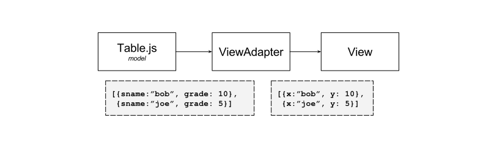

# DC3: Evaluating Student's Grades

Marc Spehlmann 
cs765 Gleicher 
9 May 2017

______

Website: [cs page](http://pages.cs.wisc.edu/~spehlmann/cs765/main.html) 
Source:  [github](https://github.com/cramja/cs765-project)
______

## Task Analysis

The purpose of this visualization tool is to help instructors understand overall class performance.

### Supported Tasks

**Heat Map**

Many of the tasks listed on the problem description involved seeing trends in student submissions. Things like, "find student who improves mid-term" or "find a student who does consistently well" are essentially supported by displaying the base data without any aggregation. To this end, I felt that a heatmap suited the task. To track a trend across a single student/assignment, one need only scan across a row/column. 

The interactive component to the Heat Map enables the user to try out different sort orders and display different stats. In my experience, I found the instantaneousness of this feature to be hugely helpful in visualizing the data. It allows for quick exploration.

The heatmap includes an `AVG` column for both key attributes. This enables the user to get an idea of how well the student or assignment performed overall.

**Chart**

I also wanted to support the task of seeing all of a student's data at once. Essentially, this meant seeing a single row in a database. To support this task I added a chart view of the cleaned data. Because seeing data in a static table is of limited use, I also added sorting functionality so that when a user clicks on a table header, the data will sort on that column. This allows the user to see a list of the actual numeric ordering of data. Another bonus, is that they can copy/paste the table into Excel and then do a more complicated analysis.

### Limitations

**Lack of Correlations**

One of the main limitations of this approach was that it does not allow for finding correlations between stats. That is, the heatmap is good at displaying 1 stat well, but, if the user wanted to see the relationship between `numPosts` and `score`, they would have a hard time. 

To support this correlations-finding task, a scatter plot or scatter plot matrix could be used. If implemented with the ability to brush and link while highlighting selected rows in the Chart, this would be a powerful tool.

**Data Transformation**

I used the JSON data to populate the visualization. This required doing some data cleaning and re-arrangement so that it could easily be handled by the visualizations. I place this in the limitations section because, after cleaning, the user has less information than before, however it also allows for visualization so this has a silver lining. I discuss the transforms below in the **Software Design** section.

### To-do list

Regretfully, I did not have time to implement all the tasks which I wanted to. In order of importance, and perceived difficulty to implement (scale 1-5, 5 is hardest). 

1. Add ability to **sort by average stat** on the heat map. I.E. the behavior would be, user clicks on the `AVG` keyword on the heatmap and then the heatmap sorts the data on that axis based on the average values. 
**Goal:** This would allow the user to compare between similar performers. *Note: I may implement this in the next day and update my website if that's the case.*
**Difficulty: 2**

1. Add ability to **drag and drop** to re-order columns in the heatmap.
**Goal:**This would allow precise comparisons. For example, it could support the task of finding a student who (suspiciously) has exactly the same scores of another (though average sorting would do the same thing, in this case).
**Difficulty: 5**

1. Add **selection highlights** linked between the Chart and Heatmap. If a user clicks on a square in the heatmap, it should cause the chart to scroll and highlight the corresponding row in the Chart.
**Goal:** This would quickly allow the user to find the source tuple associated with the view.
**Difficulty: 2**

1. Add **correlations scatterplot matrix**. As discussed above, this would allow the user to compare measures.
**Difficulty: 4**

1. Detailed **subview tiles** for the heat map. 
**Goal:** This would be useful for seeing post (list) data displayed on the heatmap without aggregating.
**Difficulty: 3**

### Task Reflection

Originally, I tried implementing a box plot view. For each assignment, a box plot of its stats would be displayed. The user would select a student and that student's score would then be highlighted in the box plot. This design was good for a one-all relationship view, but it was harder to track trends this way so I did not go through with this design.

Overall, I felt that the heatmap was the simplest design that hit on the majority of the tasks listed in the description.

## Software Design

**Data Transforms**

To make the software design easier, I wanted a single source of data: a single, denormalized table. This adds redundancy, but made it so that I only had to do a join operation at load time.

There were many stats which could easily be extracted from the JSON without transformations. These included `score` and `lateness`. However, to nicely fit the single table structure which I implemented, other stats had to be derived from list attributes. For example, `avgPostLen` is the average length of the posts which a student submitted for an assignment. This had to be coupled with `totalPostLen` to give a complete picture of how many words a student submitted. A limitation here is that we lose information about the individual posts. I added a column to the chart, `posts`, which shows a list of the posts' individual lengths to help remedy this, though it's a primitive form of visualization.

**MVC**

I wanted to support operations where one graphical element applies a transformation to the data, and its update triggers an update in a graphical element which is displaying the same base data. While D3 provides an excellent abstraction for binding/updating data with a single DOM element, it's left up the the user to decide how to do shared data transforms. To this end, I implemented a simple Model-View-Controller scheme. Outlined below is the basic interaction.

The abstraction became fuzzy with the chart because I combined control elements with view elements. I am unsure if it really matters for my purposes, I would need more practice implementing these kinds of frameworks if I were to have a strong opinion between a short, spaghetti-code style implementation versus a verbose but organized MVC style of design.

**Reuse**

I tried designing my classes in such a way as to be generic. This meant that the View classes expected data to come in a rigid, but generic format. For example the HeatMap expects tuples in a list like `[{x:NumericValue, y:NumericValue, z:NumericValue}, ...]`. This rigidity makes the view adaptable, but also requires another component to marshal the data between the `Model` format to the `View` format. I call this the `ViewAdapter` and I wrote them inside of the files which contained the views.

## Commentary

It was very easy to get "lost in the weeds" with the implementation details. After understanding D3, I still had to figure out what was the proper way to structure the program. This was actually quite a lot of fun! Though I realize that the time spent on design and implementation was time not spent exploring different visualization possibilities.

